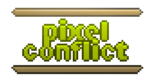
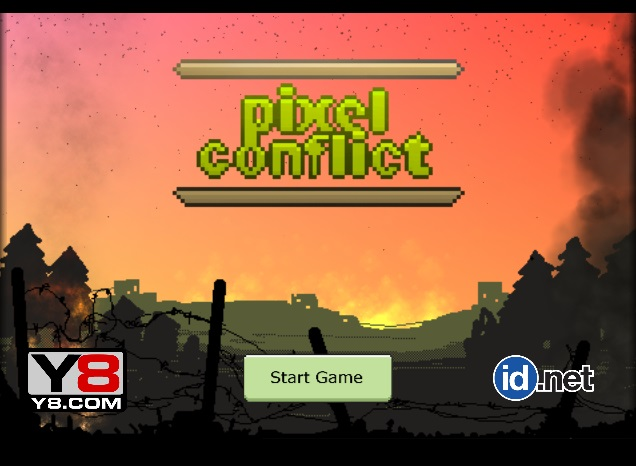
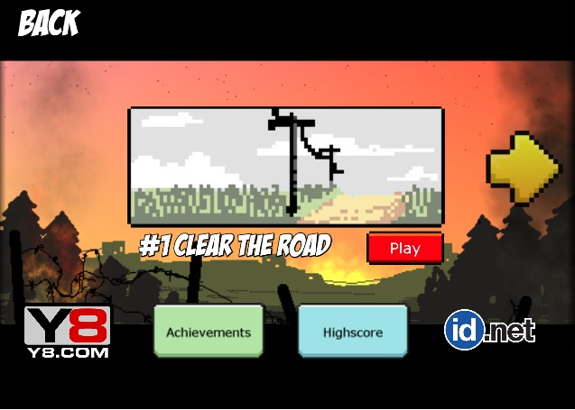
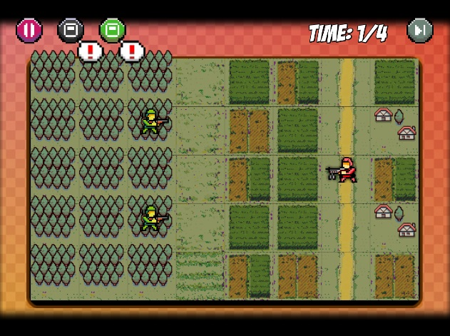
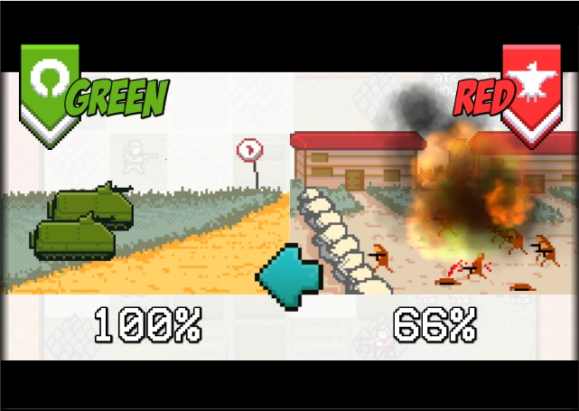

# PixelConflict

Pixel Conflict is turn based game with pixel style about battlefield. User plays green team while the AI plays red team. The are several levels in the game. Each level has certain objective. For example user must capture certain tile before x turns or destroy all units etc. You can play this game online [here](http://www.y8.com/games/pixel_conflict).

I developed all elements in the game from art, animation to its code. It is developed using [Starling Framework](http://gamua.com/starling/) and [Adobe Air](http://www.adobe.com/products/air.html). Altough this game ported to web it is possible to port it to android/iOS because Starling framework is cross platform framework. I design this game with mobile in mindset. You will see that my game UI below is mobile friendly but then I publish it only on web version. 

Its AI at first built using Adaptive Neural Network and Influence Map [(research paper)](http://https://www.aaai.org/Papers/AIIDE/2008/AIIDE08-027.pdf]) but then it changed to Finite State Machine (FSM) AI because I can't control ANN AI manually when I need to design game level.

This game covers some features:
- Y8 API implementation
- Design pattern in the game like Model-view-controller pattern in game, factory pattern, observer pattern etc
- A* shortest path 
- Pixel art assets
- local save using shared object
- Beautiful code :P

